# Filament Timeline View

[](https://packagist.org/packages/devletes/filament-timeline-view)
[](https://packagist.org/packages/devletes/filament-timeline-view)
[](https://packagist.org/packages/devletes/filament-timeline-view)
[](https://github.com/devletes/filament-timeline-view/stargazers)

Render Filament Tables as a chronological timeline. Adds two table macros (`->asTimeline()` and `->asDoubleSidedTimeline()`) plus a `TimelineEntry` layout column that turns any table query into a feed of date-grouped cards with avatars, time stamps, collapsible day groups, a kebab actions dropdown, and a Load-more button — all wired through Filament's standard query, grouping, action, and pagination APIs.

## Requirements

- PHP `^8.2`
- Filament Tables `^5.0` (the package only requires `filament/tables`; `filament/filament` is not needed unless you embed the timeline in a panel)

## Installation

```bash
composer require devletes/filament-timeline-view
```

No plugin registration needed — the service provider auto-loads, registers the Table macros, and registers the CSS asset with Filament's asset system. Publish the asset once after install:

```bash
php artisan filament:assets
```

## Usage

The package adds two macros to `Filament\Tables\Table`:

| Macro | Renders |
|---|---|
| `->asTimeline()` | Single-column vertical timeline. Cards on the right of the line, dots on the left. |
| `->asDoubleSidedTimeline()` | Centre line with cards alternating left/right. Collapses to single-column below 768px. |

You compose the timeline using Filament's standard table API: `->query()`, `->columns()`, `->groups()`, `->actions()`, `->paginated()`. Just swap `->columns()` for `TimelineEntry::make()` and call one of the timeline macros at the end.

### Resource list page

```php
use Devletes\FilamentTimelineView\Tables\Columns\TimelineEntry;
use Filament\Actions\ActionGroup;
use Filament\Actions\ViewAction;
use Filament\Actions\EditAction;
use Filament\Actions\DeleteAction;
use Filament\Tables\Grouping\Group;
use Filament\Tables\Table;

class ListPulses extends ListRecords
{
    protected static string $resource = PulseResource::class;

    public function table(Table $table): Table
    {
        return $table
            ->columns([
                TimelineEntry::make()
                    ->title('title')
                    ->content('body')
                    ->image('hero_image_url')
                    ->author('author.name', 'author.avatar_url')
                    ->time('published_at'),
            ])
            ->defaultGroup(Group::make('published_at')->date())
            ->recordActions([
                ActionGroup::make([
                    ViewAction::make(),
                    EditAction::make(),
                    DeleteAction::make(),
                ]),
            ])
            ->paginated([10])
            ->asTimeline();
    }
}
```

| Light | Dark |
|---|---|
| 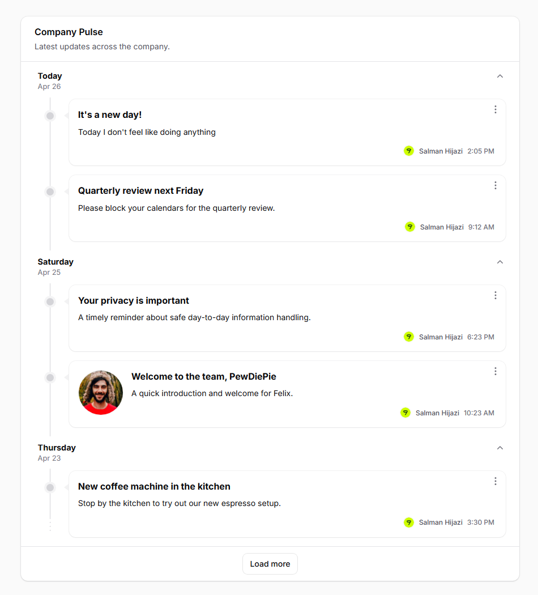 | 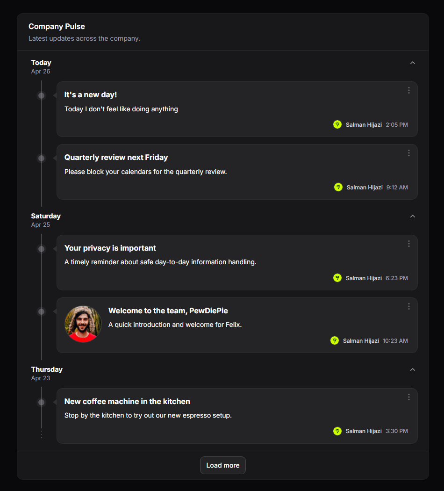 |

### Dashboard widget

`TimelineEntry` is a Tables column, so anywhere you can build a `Filament\Widgets\TableWidget`, you can render a timeline:

```php
use Devletes\FilamentTimelineView\Tables\Columns\TimelineEntry;
use Filament\Tables\Grouping\Group;
use Filament\Tables\Table;
use Filament\Widgets\TableWidget;

class CompanyPulseWidget extends TableWidget
{
    protected int|string|array $columnSpan = 'full';

    public function table(Table $table): Table
    {
        return $table
            ->heading('Company Pulse')
            ->description('Latest updates across the company.')
            ->query(fn () => app(EmployeeDashboardService::class)
                ->pulseFeedQuery(Filament::auth()->user())
                ->with(['author']))
            ->defaultSort('published_at', 'desc')
            ->columns([
                TimelineEntry::make()
                    ->title('title')
                    ->content('excerpt')
                    ->image('hero_url')
                    ->author('author.name', 'author.avatar_url')
                    ->time('published_at'),
            ])
            ->defaultGroup(Group::make('published_at')->date())
            ->recordActions([
                Action::make('view')
                    ->icon('heroicon-m-eye')
                    ->url(fn ($record) => PulsePostResource::getUrl('view', ['record' => $record])),
            ])
            ->paginated([5])
            ->asTimeline();
    }
}
```

Embed in a custom Dashboard page via `Filament\Schemas\Components\Livewire`:

```php
use Filament\Schemas\Components\Livewire;

public function content(Schema $schema): Schema
{
    return $schema->components([
        Livewire::make(CompanyPulseWidget::class)->columnSpan('full'),
    ]);
}
```

### Double-sided variant

Swap `->asTimeline()` for `->asDoubleSidedTimeline()`. Cards alternate per date — the first item of every date always lands on the left, so single-item days stay consistent. Below 768px the layout collapses to a single chronological column.

```php
return $table
    ->columns([TimelineEntry::make()->...])
    ->groups([Group::make('published_at')->date()])
    ->asDoubleSidedTimeline();
```

| Light | Dark |
|---|---|
| 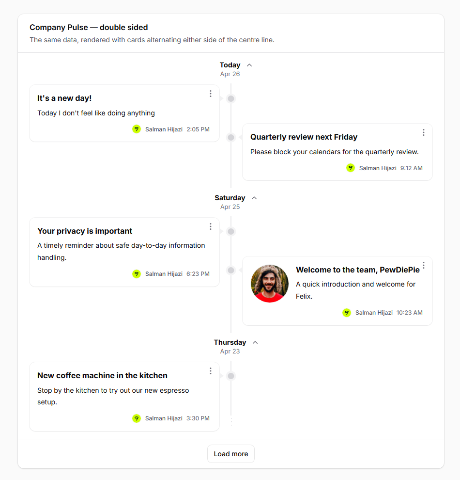 | 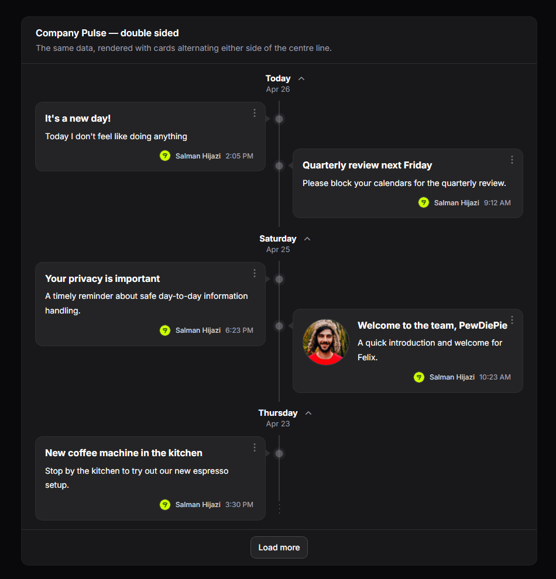 |

## The `TimelineEntry` column

`TimelineEntry::make()` is a layout column (extends `Filament\Tables\Columns\Layout\Component`). It produces the inner content of one card. The `.ftv-card` chrome — border, padding, dot, caret, and the actions kebab — is provided by the package blade and applied to every record regardless of which layout column you use.

### Field setters

| Method | Purpose |
|---|---|
| `->title($field)` | The card title. |
| `->content($field)` | The card body / excerpt. Newlines render as `<br>`. |
| `->image($field)` | A circular image rendered to the left of the body. |
| `->author($name, $avatar = null)` | A small avatar + name in the card footer. |
| `->time($field, $format = 'g:i A')` | A small time stamp in the footer. Carbon-parsed. |

| Light | Dark |
|---|---|
| 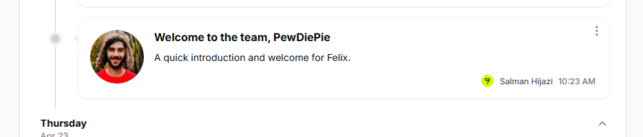 | 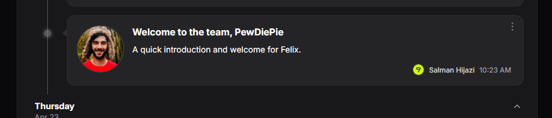 |

Each setter accepts either a **string field path** (resolved via `data_get($record, $path)`) or a **`Closure`** receiving the record:

```php
TimelineEntry::make()
    ->title('title')                                          // dot-notation field path
    ->content(fn ($record) => strip_tags($record->html_body)) // closure
    ->image(fn ($record) => $record->cover?->getUrl('thumb')) // closure
    ->author(
        'author.name',                                         // string path
        fn ($record) => $record->author?->getFilamentAvatarUrl(), // closure
    )
    ->time('published_at')
```

For `time()`, a closure may return a `Carbon` instance (formatted via `translatedFormat($format)`) or a pre-formatted string (used as-is).

### Custom layouts

`TimelineEntry` is opinionated. If you need a different inner structure, drop it for `Stack::make([...])` (or any other column-layout component) and the timeline will still render the dot, caret, card chrome, and actions kebab around it:

```php
use Filament\Tables\Columns\ImageColumn;
use Filament\Tables\Columns\Layout\Split;
use Filament\Tables\Columns\Layout\Stack;
use Filament\Tables\Columns\TextColumn;

->columns([
    Stack::make([
        Split::make([
            ImageColumn::make('cover_url')->circular()->size(60)->grow(false),
            Stack::make([
                TextColumn::make('title')->weight('bold')->size('lg'),
                TextColumn::make('summary')->color('gray'),
                Split::make([
                    TextColumn::make('author.name')->size('xs')->color('gray'),
                    TextColumn::make('published_at')->time()->size('xs')->color('gray')->alignEnd(),
                ]),
            ]),
        ]),
    ]),
])
```

| Light | Dark |
|---|---|
| 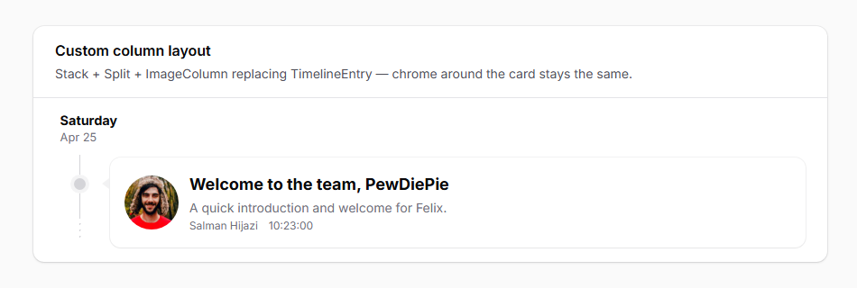 | 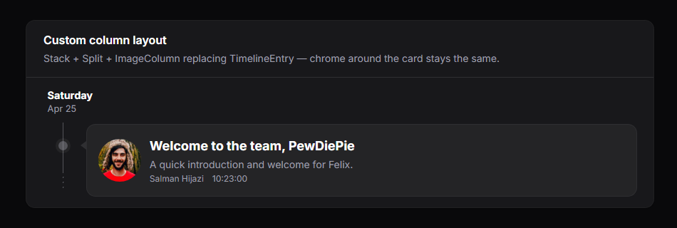 |

## Date grouping

Use Filament's standard `Group` API. When the group is a date (`->date()`), the package renders a date header above each group with this resolution:

- **Today** → `Today` (translated)
- **Otherwise** → the weekday name (`Wednesday`, `Tuesday`, …)
- A second line under the weekday shows `M j` (e.g. `Apr 8`), with the year appended for dates outside the current year.

```php
->defaultGroup(Group::make('published_at')->date())
```

Pass the `Group` instance straight to `->defaultGroup(...)` — no need for a separate `->groups([...])` array unless you want the group selector in the toolbar (which a timeline rarely does, since the grouping is the whole point).

> **Newest-first ordering.** Filament's date grouping orders ascending by default, which puts Today at the bottom. For a typical chronological feed you'll want to flip it on the `Group`:
>
> ```php
> ->defaultGroup(
>     Group::make('published_at')
>         ->date()
>         ->orderQueryUsing(fn ($query) => $query->orderByDesc('published_at'))
> )
> ```

| Light | Dark |
|---|---|
| 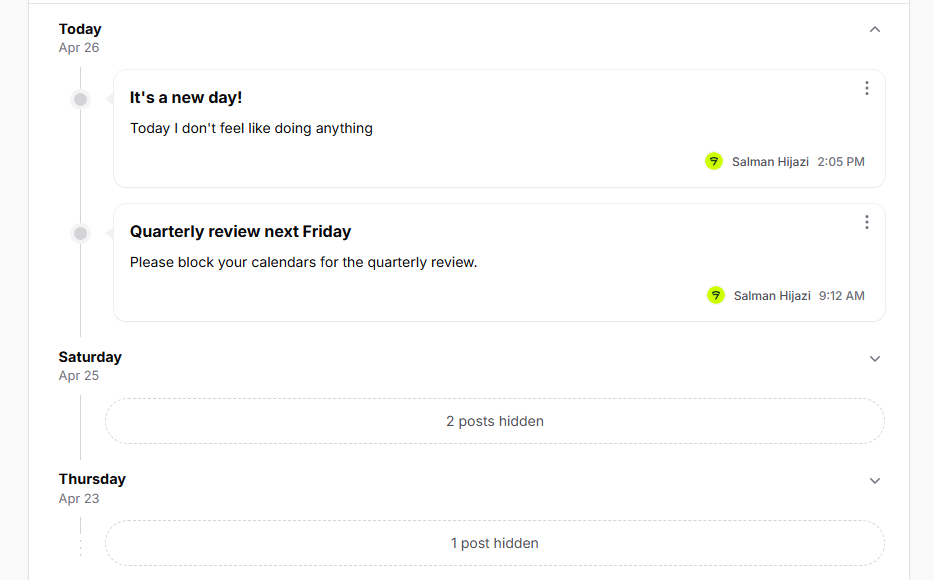 | 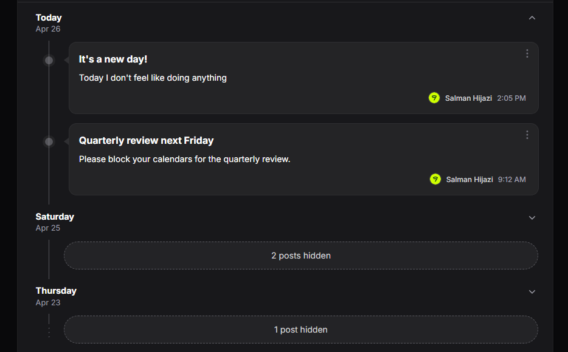 |

## Day-group collapse (opt-in)

Day groups are **not collapsible by default**. To make them collapsible, call `->collapsible()` on the `Group`:

```php
->defaultGroup(Group::make('published_at')->date()->collapsible())
```

When enabled, each date header gets a chevron toggle that hides/shows the day's cards via Alpine.js (no Livewire round-trip). Collapsed groups show a translated "N posts hidden" pill (`collapsed_summary` translation key) in place of the cards.

| Light | Dark |
|---|---|
| 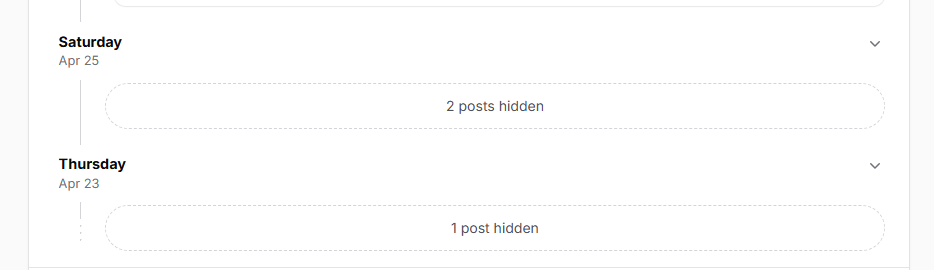 | 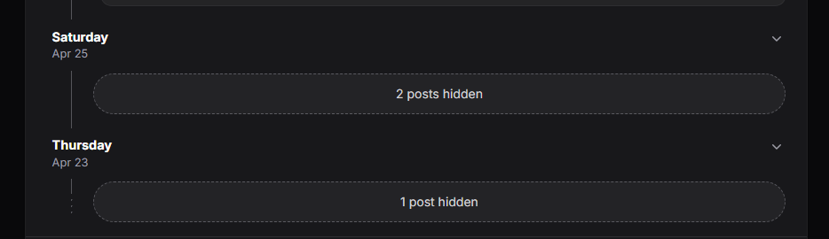 |

## Per-card actions

Every record gets a single kebab dropdown in the top-right of the card. The package consumes the table's `recordActions(...)` config and **always renders exactly one `ActionGroup`** per card:

- If you pass a single `ActionGroup` → it's used as-is, preserving your `->color()`, `->dropdownPlacement()`, and other settings.
- If you pass a flat array of actions, multiple action groups, or a mix → the package extracts every underlying action via `getFlatActions()` and wraps them in one fresh `ActionGroup::make([...])->color('gray')`.

Either way the visual is one kebab. Hidden actions (`->hidden()` / `->visible()`) are filtered per record before rendering.

```php
->recordActions([
    ActionGroup::make([
        ViewAction::make(),
        EditAction::make()->color('primary'),
        DeleteAction::make()->requiresConfirmation()->color('danger'),
    ])->color('gray'),
])
```

Action click handlers use Filament's standard `mountAction(...)` flow, so `->action(fn ($record) => ...)`, modals, notifications, and forms all work as they would on any normal table.

| Light | Dark |
|---|---|
| 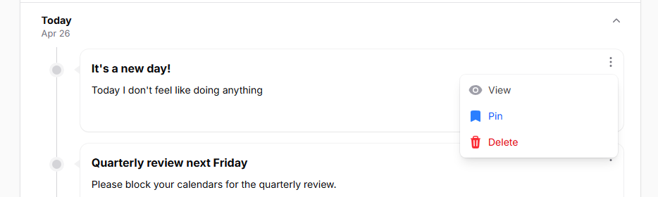 | 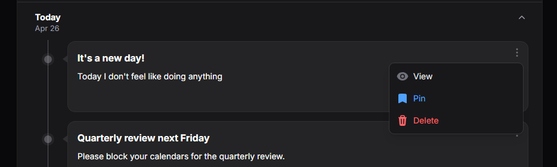 |

## Pagination → Load more

`->paginated([N])` enables pagination. The package replaces Filament's prev/next page links with a single **Load more** button that bumps `tableRecordsPerPage` by `N` on each click. `paginated([5])` shows 5 rows initially and adds 5 more per click.

```php
->paginated([5])
```

> The package renders only the Load more button — Filament's stock per-page selector and prev/next links don't appear. Pass a single-value array like `[5]` rather than the multi-value form (`[5, 10, 25]`) — only the first integer is used as the increment, the rest are ignored.

The button hides automatically when the underlying paginator's `hasMorePages()` returns false. It briefly disables and shows a loading spinner during the request.

If you want vanilla page-link pagination, leave `->paginated(...)` set but skip the timeline macro — you'll get Filament's default rendering.

| Light | Dark |
|---|---|
| 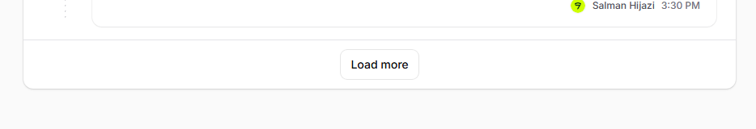 | 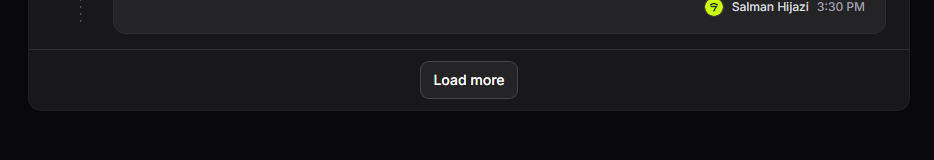 |

## Theming

The package's geometry — line position, card surface, dot colours, caret accent — is driven by a small set of CSS custom properties you can override without forking the stylesheet.

Root-level (`.ftv-shell`):

| Variable | Purpose |
|---|---|
| `--ftv-line-color` | Vertical line, dots, and dashed terminator colour. |
| `--ftv-card-surface` | Card background (also used as the "halo" around each dot). |
| `--ftv-card-ring` | Card ring / border colour; also drives the caret colour. |
| `--ftv-hover-shadow-color` | Card hover shadow. |

Per-group (`.ftv-group-body`):

| Variable | Purpose |
|---|---|
| `--ftv-line-x` | Horizontal offset of the timeline line. Dots and carets derive from this. `1.7rem` desktop, `0.65rem` mobile. |

Dark mode automatically picks up adjusted values via `.dark .ftv-shell`.

To override per panel, add a rule to your panel's theme CSS:

```css
.fi-ta-timeline {
    /* Override container padding, e.g. flush against the section card. */
    padding: 0;
}

.dark .ftv-shell {
    --ftv-line-color: oklch(50% 0.04 240);
}
```

| Light | Dark |
|---|---|
| 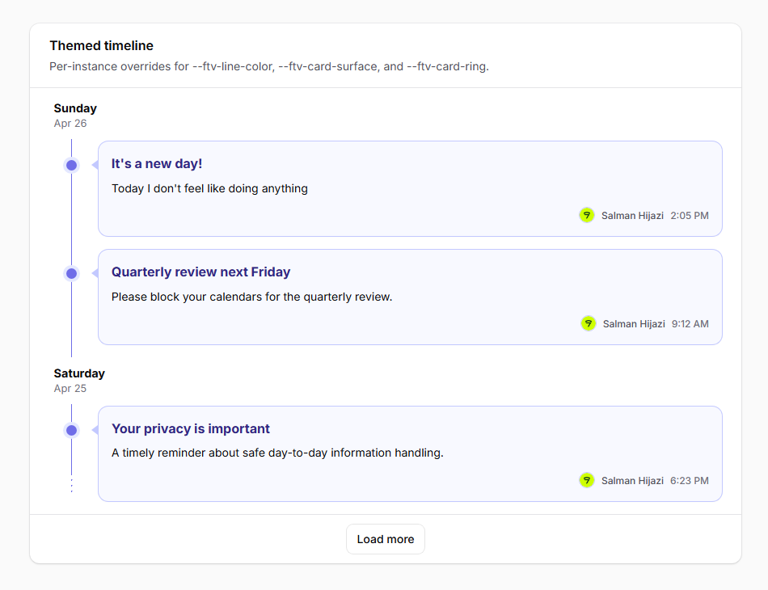 | 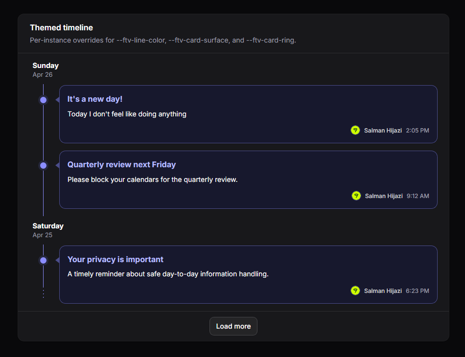 |

## Translations

All user-facing strings go through `trans('filament-timeline-view::timeline.*')`. Weekday and month names use Carbon's `translatedFormat()` which respects the app's locale.

To customize strings or add locales, publish the language files:

```bash
php artisan vendor:publish --tag=filament-timeline-view-translations
```

Then edit or add files under `lang/vendor/filament-timeline-view/`.

Keys:

- `today` — "Today" label shown when the group's date is today.
- `load_more` — Load more button label.
- `toggle_day` — aria-label template for the collapse toggle (`:day` placeholder).
- `collapsed_summary` — pluralized "N posts hidden" shown in the collapsed state.
- `empty_state.heading` / `empty_state.description` — default empty-state copy. Override per-table via `->emptyStateHeading(...)` / `->emptyStateDescription(...)`.

Ships with `en` and `de` out of the box.

| Light | Dark |
|---|---|
| 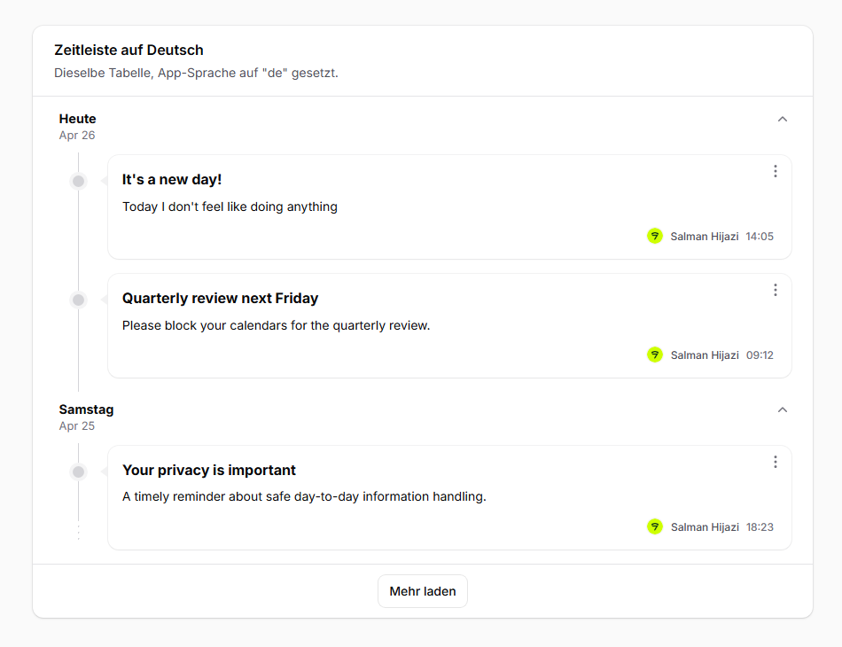 | 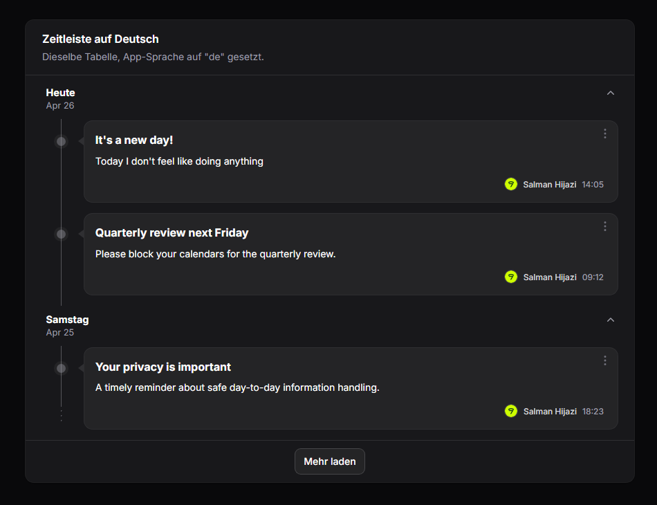 |

## Need something custom?

We build production Filament panels and plugins for teams that want to ship fast without compromising on polish. If you need a custom feature, an extended variant of this package, or a fully bespoke component built for your stack, we can help.

- **Browse the rest of our Filament work:** [filament.devletes.com](https://filament.devletes.com)
- **Get in touch:** [salman@devletes.com](mailto:salman@devletes.com)

Typical engagements: new Filament plugins, custom resources/widgets/actions, theme + UX work, integrations with your existing services, and one-off tailored forks of our open-source packages.

## Credits

- [Salman Hijazi](https://www.linkedin.com/in/syedsalmanhijazi/)

## License

MIT. See [LICENSE.md](LICENSE.md).
